# Cloudflare Security Hardening

> **Target:** [resume.vanshbhardwaj.com](https://resume.vanshbhardwaj.com) — a live Azure-hosted resume site  
> **Objective:** Harden a real production web application using Cloudflare's security platform  
> **Built on top of:** [azure-resume](https://github.com/VanshBhardwaj1945/azure-resume)

---

## Table of Contents

1. [Project Overview](#project-overview)
2. [Architecture](#architecture)
3. [Phase 1 — Threat Observation](#phase-1--threat-observation)
4. [Phase 2 — WAF and Firewall Rules](#phase-2--waf-and-firewall-rules)
5. [Phase 3 — Zero Trust Access](#phase-3--zero-trust-access)
6. [Phase 4 — Security Headers Worker](#phase-4--security-headers-worker)
7. [Phase 5 — Bot Protection](#phase-5--bot-protection)
8. [Phase 6 — Page Shield](#phase-6--page-shield)
9. [Infrastructure as Code](#infrastructure-as-code)
10. [Key Findings and Takeaways](#key-findings-and-takeaways)

---

## Project Overview

This project extends my [Azure Cloud Resume Challenge](https://github.com/VanshBhardwaj1945/azure-resume) by layering Cloudflare's security platform on top of a live production site. Rather than simulating attacks in a sandbox, everything here is implemented against real traffic on a real domain.

The goal is to demonstrate a security-first approach to web application hardening using Cloudflare's tooling — the same tools used to protect millions of Internet properties globally.

**What was already in place:**
- Cloudflare DNS with DNSSEC enabled
- Azure Front Door for CDN and HTTPS termination
- Azure Functions API (visitor counter) — a real attack surface

**What this project adds:**

| Phase | What | Status |
|---|---|---|
| 1 | Security Analytics — observe real traffic | Complete |
| 2 | WAF + Firewall Rules — block attacks | Complete |
| 3 | Zero Trust Access — identity gate on protected resource | Complete |
| 4 | Security Headers Worker — inject headers at the edge | Complete |
| 5 | Bot Protection — block automated and AI traffic | Complete |
| 6 | Page Shield — monitor client-side scripts | In progress |

---

## Architecture

```
Internet
    |
    v
Cloudflare Edge (330+ cities)
    |-- DNS + DNSSEC              <- already in place
    |-- DDoS Protection           <- automatic on all plans
    |-- Bot Fight Mode            <- Phase 5
    |-- WAF / Firewall Rules      <- Phase 2
    |-- Cloudflare Access         <- Phase 3
    |-- Cloudflare Workers        <- Phase 4
    |-- Page Shield               <- Phase 6
    |
    v
Azure Front Door (CDN + HTTPS)
    |
    |-- Azure Storage (Static Website)
    |   |-- /admin                <- protected by Cloudflare Access
    |
    |-- Azure Functions (Visitor Counter API)
        |
        |-- Azure Cosmos DB
```

Every request to `resume.vanshbhardwaj.com` passes through Cloudflare before it ever reaches Azure. This gives a programmable security layer at the edge — close to the attacker, far from the origin.

---

## Phase 1 — Threat Observation

### Objective
Before building any defenses, observe what is actually hitting the site. The goal was to understand the threat landscape before writing a single rule — the same way a real security engineer would approach hardening a production system.

### What I Looked At
- Cloudflare Security Analytics dashboard — request volume, served vs mitigated traffic
- HTTP method breakdown — identifying unexpected POST requests on a static site
- Source IP analysis — identifying non-human traffic

### Findings

**Traffic summary (last 24 hours):**

| Metric | Value |
|---|---|
| Total requests | 12 |
| Served by Cloudflare edge | 7 |
| Served by origin (Azure) | 5 |
| Unique source IPs | 3 |
| Countries | United States only |

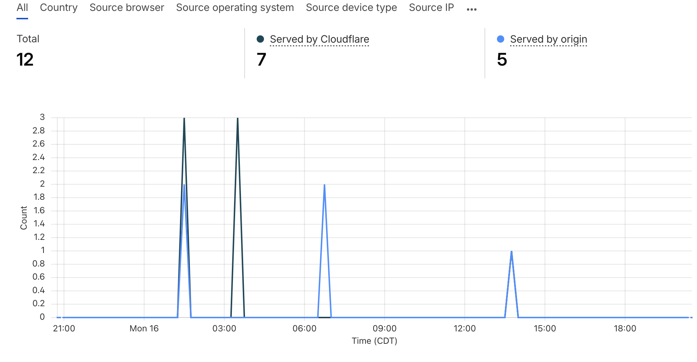

**Notable observation — Unknown AWS bot (`3.18.186.238`):**

An IP outside my own devices made two automated requests to the site root (`/`) at 6:54 AM and 6:55 AM while no human activity was expected. A `whois` lookup confirmed the IP belongs to Amazon EC2 — meaning an automated process running on AWS was crawling the site. The requests loaded only the root path with no subsequent asset requests, which is characteristic of a crawler doing reconnaissance rather than a real browser visit.

```bash
$ whois 3.18.186.238
OrgName: Amazon Technologies Inc.
OrgId:   AT-88-Z
Address: 410 Terry Ave N., Seattle WA 98109
```

**Unexpected POST requests:**

4 out of 12 requests used the POST method. This site is a static resume — there are no forms or endpoints that should accept POST requests from the public. This is a classic signal of automated probing.

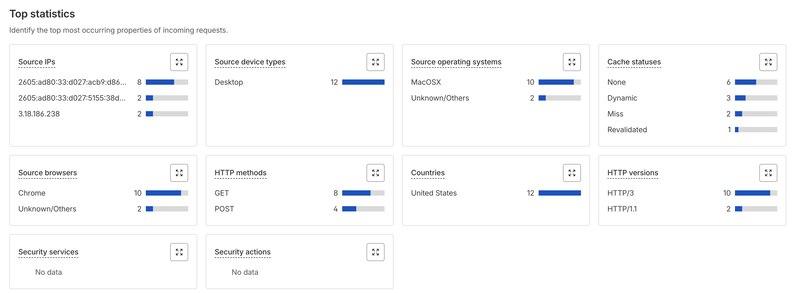

**Documented observations:** [docs/threat-observations.md](docs/threat-observations.md)

### What This Informed
Two categories of rules to build in Phase 2:

1. **Observation-based** — block unexpected HTTP methods on a static site
2. **Best practice** — block known attack tool User-Agents, block SQLi and XSS patterns, rate limit the API endpoint

---

## Phase 2 — WAF and Firewall Rules

### Objective
Translate the observations from Phase 1 into active defenses. All rules follow the principle of **default deny** — block anything that has no legitimate reason to exist on this site.

All rules are version-controlled as Terraform code in [terraform/waf.tf](terraform/waf.tf) and were imported into Terraform state after being built and verified in the Cloudflare dashboard.

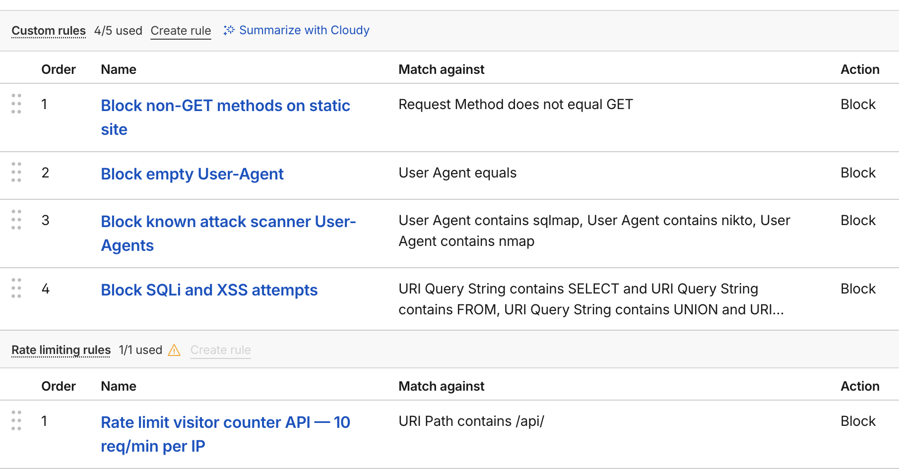

### Rules Implemented

| Order | Rule Name | Type | Action |
|---|---|---|---|
| 1 | Block non-GET methods on static site | Custom rule | Block |
| 2 | Block empty User-Agent | Custom rule | Block |
| 3 | Block known attack scanner User-Agents | Custom rule | Block |
| 4 | Block SQLi and XSS attempts | Custom rule | Block |
| 5 | Rate limit visitor counter API | Rate limiting | Block |

---

### Rule 1 — Block Non-GET Methods

**Expression:**
```
(http.request.method ne "GET")
```

**Why:** This is a static resume website. The only legitimate HTTP method is GET. POST, PUT, DELETE, PATCH, and other methods have no valid use here. The 4 POST requests observed in Phase 1 confirmed this. Blocking all non-GET requests eliminates an entire class of attacks including form injection and API abuse attempts.

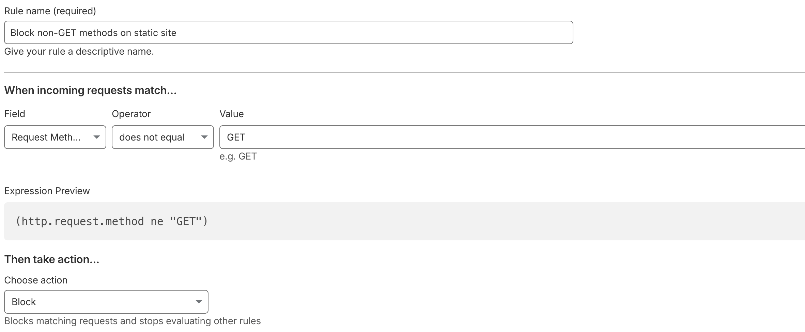

---

### Rule 2 — Block Empty User-Agent

**Expression:**
```
(http.user_agent eq "")
```

**Why:** Every legitimate browser sends a User-Agent header identifying itself. Automated bots and vulnerability scanners frequently omit this header because they are not pretending to be a real browser. Blocking empty User-Agents eliminates a large volume of low-effort automated traffic before it consumes any origin resources.

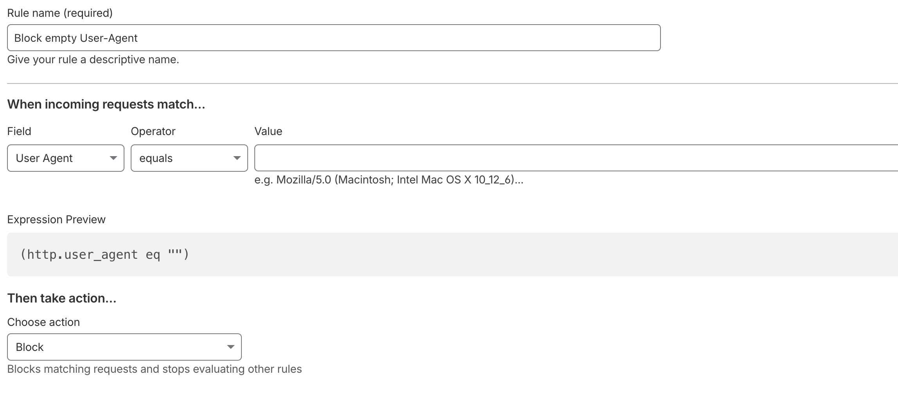

---

### Rule 3 — Block Known Attack Scanner User-Agents

**Expression:**
```
(http.user_agent contains "sqlmap") or
(http.user_agent contains "nikto") or
(http.user_agent contains "nmap")
```

**Why each tool is blocked:**

| Tool | What It Does |
|---|---|
| `sqlmap` | Automated SQL injection tool — systematically tries hundreds of injection techniques against every input |
| `nikto` | Web vulnerability scanner — probes for thousands of known misconfigurations and CVEs |
| `nmap` | Network scanner — maps open ports and services for reconnaissance |

Legitimate users never send these strings as their User-Agent. Blocking by name is a zero-false-positive rule.

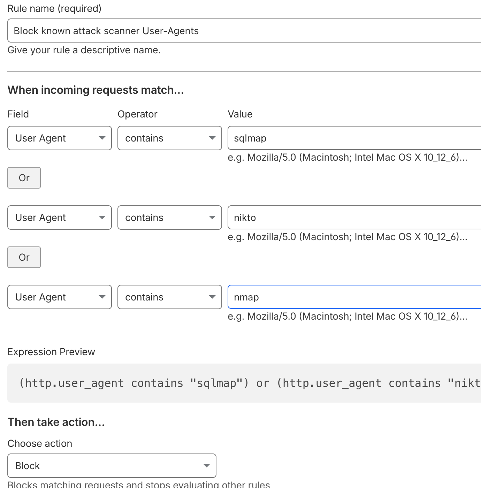

---

### Rule 4 — Block SQLi and XSS Attempts

**Expression:**
```
(http.request.uri.query contains "SELECT" and http.request.uri.query contains "FROM") or
(http.request.uri.query contains "UNION" and http.request.uri.query contains "SELECT") or
(http.request.uri.query contains "DROP TABLE") or
(http.request.uri.query contains "INSERT INTO") or
(http.request.uri.query contains "OR 1=1") or
(http.request.uri.query contains "<script") or
(http.request.uri.query contains "javascript:") or
(http.request.uri.query contains "onerror=") or
(http.request.uri.query contains "../") or
(http.request.uri.query contains "etc/passwd")
```

**Why each pattern is blocked:**

| Pattern | Attack Type | What It Does |
|---|---|---|
| `SELECT...FROM` | SQL Injection | Core SQL read query — extracts database contents |
| `UNION SELECT` | SQL Injection | Joins malicious query to legitimate one to steal data from other tables |
| `DROP TABLE` | SQL Injection | Permanently deletes database tables |
| `INSERT INTO` | SQL Injection | Writes data directly into the database |
| `OR 1=1` | SQL Injection | Makes WHERE conditions always true — returns all records |
| `<script` | XSS | Injects JavaScript that executes in other users' browsers |
| `javascript:` | XSS | Executes JS via href attributes |
| `onerror=` | XSS | Executes JS via HTML event handlers |
| `../` | Path Traversal | Navigates outside web root to access system files |
| `etc/passwd` | Path Traversal | Targets Linux user account file — classic recon target |

These patterns cover the most critical categories of the OWASP Top 10. Cloudflare's managed OWASP ruleset handles this automatically on paid plans. On the free tier these custom rules replicate that core protection manually.

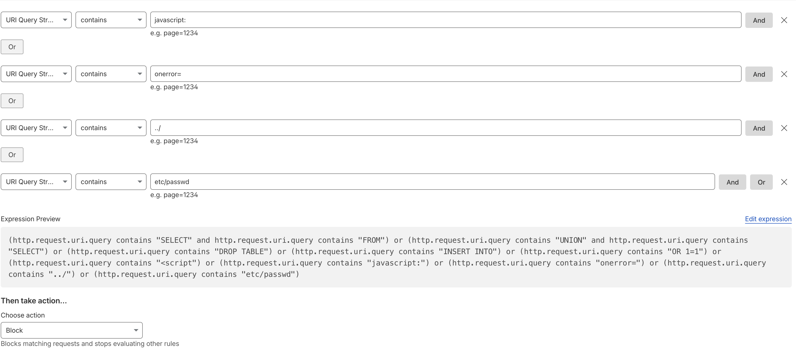

---

### Rule 5 — Rate Limit the Visitor Counter API

**Configuration:**
- **Match:** URI Path contains `/api/`
- **Characteristics:** IP address
- **Limit:** 4 requests per 10 seconds per IP
- **Duration:** Block for 10 seconds
- **Action:** Block

**Why:** The visitor counter Azure Function is a public HTTP endpoint with no built-in rate limiting. Without this rule, a script could call it thousands of times per second — inflating the counter, exhausting Cosmos DB request units, and potentially taking the function down. Rate limiting at the Cloudflare edge stops abuse before it ever reaches Azure.

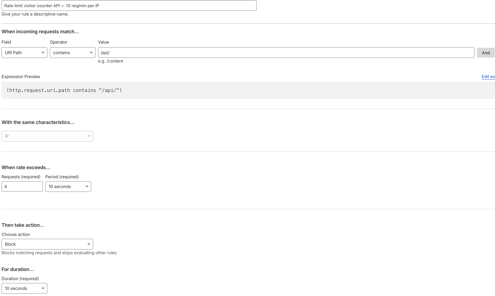

---

## Phase 3 — Zero Trust Access

### Objective
Demonstrate Zero Trust principles by putting an identity gate in front of a protected resource. No implicit trust — every request must prove identity before access is granted.

### What Zero Trust Means
Traditional security assumes anyone inside the network perimeter is trusted. Zero Trust flips this — trust nobody by default, verify every request regardless of where it comes from.

Cloudflare Access implements this by sitting in front of any resource and requiring authentication before the request ever reaches the origin. Unauthenticated requests are redirected to a Cloudflare-hosted login page — the origin server never sees them.

### What I Protected

Created a protected admin page at `resume.vanshbhardwaj.com/admin` hosted on the same Azure Storage static website as the rest of the site. Without Cloudflare Access this page is publicly accessible. With Access, every visitor must verify their email via a one-time PIN before the page loads.

**Protected resource:** [frontend/admin/index.html](https://github.com/VanshBhardwaj1945/azure-resume/blob/main/frontend/admin/index.html)

### How It Works

```
User visits resume.vanshbhardwaj.com/admin
        |
        v
Cloudflare Access intercepts request
        |
        |-- Has valid session token? -> Allow through to origin
        |
        |-- No token? -> Redirect to Cloudflare login page
                        |
                        v
                User enters email address
                        |
                        v
                Cloudflare sends one-time PIN to that email
                        |
                        v
                User enters PIN -> Session token issued
                        |
                        v
                Access granted -> Origin serves the page
```

### Configuration

| Setting | Value |
|---|---|
| Application name | Resume Admin Panel |
| Domain | `resume.vanshbhardwaj.com/admin` |
| Session duration | 24 hours |
| Login method | One-time PIN (email) |
| Policy | Allow everyone who completes email verification |

**Source:** [terraform/access.tf](terraform/access.tf)

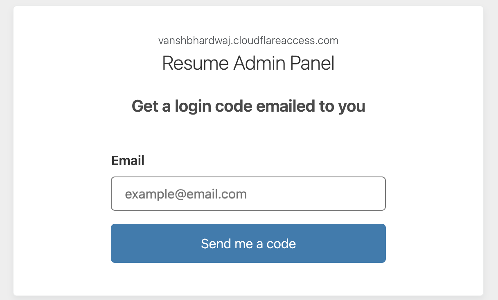

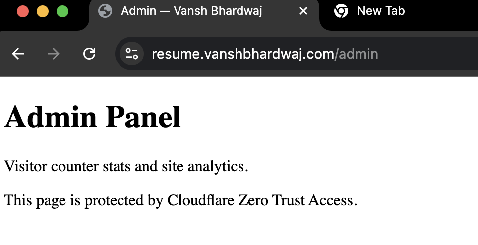

### Why This Matters

Azure Storage has no native authentication — any file in the `$web` container is publicly accessible by default. Cloudflare Access adds an identity layer in front of it without modifying the origin at all. This demonstrates that Zero Trust security can be layered on top of any resource regardless of whether that resource supports authentication natively.

---

## Phase 4 — Security Headers Worker

### Objective
Deploy a Cloudflare Worker to inject HTTP security headers into every response from the site. These headers instruct the browser on how to behave securely — limiting what it trusts, what it loads, and how it connects.

**Source:** [workers/http-headers.js](workers/http-headers.js)

### What Are Security Headers?

When a browser loads a website, the server sends back the page along with HTTP response headers. These headers are invisible instructions that control browser behaviour. By default most servers send very few security headers, which leaves the browser open to several well-known attacks.

### Headers Implemented

| Header | Attack It Prevents | Value |
|---|---|---|
| `Content-Security-Policy` | XSS — limits what scripts and resources the browser can load | `default-src 'self'` |
| `X-Frame-Options` | Clickjacking — prevents the site being embedded in an iframe | `DENY` |
| `X-Content-Type-Options` | MIME sniffing — stops browsers guessing file types | `nosniff` |
| `Strict-Transport-Security` | HTTP downgrade attacks — forces HTTPS for 1 year | `max-age=31536000; includeSubDomains; preload` |
| `Referrer-Policy` | Referrer leakage — controls how much URL info is sent to other sites | `strict-origin-when-cross-origin` |
| `Permissions-Policy` | Feature abuse — disables browser APIs the site does not use | `camera=(), microphone=(), geolocation=()` |

### Why a Worker Instead of Configuring the Origin?

Azure Storage and Azure Front Door do not provide easy control over custom response headers. A Cloudflare Worker intercepts every response at the edge and injects these headers automatically before the response reaches the user — no changes to the origin needed.

### Verification

After deploying the Worker and attaching it to the `resume.vanshbhardwaj.com/*` route, headers were verified live using curl:

```bash
$ curl -I -X GET https://resume.vanshbhardwaj.com

strict-transport-security: max-age=31536000; includeSubDomains; preload
content-security-policy: default-src 'self'; script-src 'self' 'unsafe-inline'; ...
x-content-type-options: nosniff
x-frame-options: DENY
```

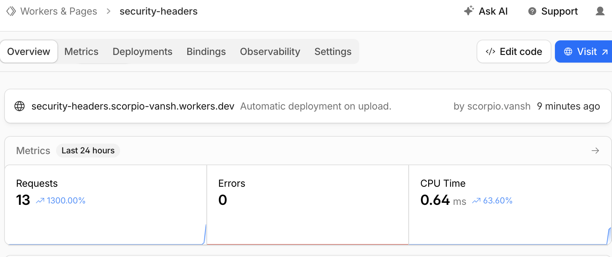

---

## Phase 5 — Bot Protection

### Objective
Enable Cloudflare's built-in bot detection and AI crawler blocking to stop automated traffic from consuming resources, polluting analytics, and scraping content.

### What I Enabled

**Bot Fight Mode**

Cloudflare assigns every incoming request a bot score from 1 to 99 — score near 1 means almost certainly a bot, score near 99 means almost certainly a real human. This scoring is trained on traffic patterns across Cloudflare's entire global network, which processes roughly 20% of all internet traffic, making it one of the most accurate bot detection systems available.

When Bot Fight Mode is enabled, requests with low bot scores are served a JavaScript challenge. Real browsers solve it silently and automatically. Simple bots that cannot execute JavaScript fail the challenge and are blocked.

**Block AI Bots**

Cloudflare maintains a list of known AI training crawlers — bots operated by AI companies to scrape web content for training datasets. This managed rule blocks all of them from accessing the site. Content published here belongs to the site owner, not to AI training pipelines.

**AI Labyrinth**

When a bot crawls the site ignoring standard crawling restrictions, Cloudflare injects hidden `nofollow` links into pages that lead to AI-generated fake content. The bot follows these links and gets stuck in an endless maze of meaningless pages, wasting its compute and time. Real users never see this content because browsers do not follow `nofollow` links automatically.

### Configuration

| Setting | Value |
|---|---|
| Bot Fight Mode | On |
| AI Labyrinth | On |
| Block AI Bots scope | Block on all pages |

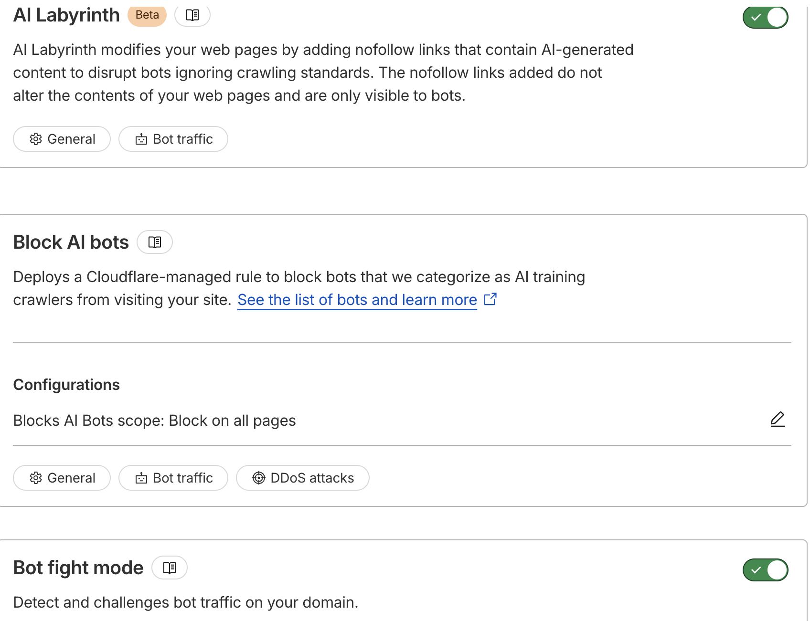

### Why This Matters

Bot traffic is one of the largest threats on the modern internet. Without bot protection, automated scrapers, vulnerability scanners, and AI crawlers can hammer an API endpoint, steal content, and pollute analytics with fake traffic. Cloudflare's bot management product is one of their core enterprise offerings — understanding how bot scoring, JS challenges, and managed bot lists work is directly relevant to their security engineering team.

---

## Phase 6 — Page Shield

### Objective
Monitor all JavaScript and third-party resources loading on the site to detect supply chain attacks — where an attacker compromises a third-party script to inject malicious code into your pages.

### What is a Supply Chain Attack?

Most websites load JavaScript from third parties — analytics, fonts, chat widgets. If one of those third parties gets compromised, the attacker can modify the script to steal data from every visitor. This is called a Magecart attack and has affected British Airways, Ticketmaster, and hundreds of other companies.

Page Shield monitors every resource loading on your site, builds a baseline of what normally loads, and alerts when something unexpected appears.

> In progress — monitoring enabled, waiting for script data to populate (requires 7 days of traffic data on the free tier).

---

## Infrastructure as Code

All Cloudflare security configuration is managed as Terraform code — no manual portal changes as the source of truth. Every rule and policy is version-controlled, auditable, and reproducible.

```
terraform/
|-- waf.tf         # WAF rulesets and custom firewall rules
|-- access.tf      # Zero Trust Access application and policy
|-- workers.tf     # Worker route bindings
|-- variables.tf   # Input variables (zone ID, account ID)
```

**Provider:** `cloudflare/cloudflare ~> 5`  
**Secrets:** passed via `CLOUDFLARE_API_TOKEN` environment variable, never committed  
**State:** local — `terraform.tfstate` gitignored

---

## Key Findings and Takeaways

**What I observed in real traffic:**
- An AWS EC2 bot (`3.18.186.238`) crawled the site at 6:54–6:55 AM — confirmed via `whois` as Amazon infrastructure doing automated reconnaissance
- 4 POST requests hit a fully static site that should only receive GETs — clear signal of automated probing
- Zero security rules were firing before this project — the site was completely undefended at the application layer

**Most impactful rule:**
Rate limiting the API endpoint — the Azure Function was a completely open endpoint. A single script could have called it thousands of times, inflating the counter and exhausting Cosmos DB resources.

**Key lesson — observe before you defend:**
The analytics phase revealed real attack patterns that directly informed the rules built in Phase 2. Building rules blind would have missed site-specific threats.

**Zero Trust in practice:**
Azure Storage has no native authentication — any file in the `$web` container is public by default. Cloudflare Access adds an identity gate without modifying the origin at all. Security enforced at the network edge, independent of the application itself.

**Why edge-based protection matters:**
Every rule and policy stops threats at the point closest to the attacker — before they consume any Azure infrastructure, before they touch the origin, before they cost anything.

---

## References

- [Cloudflare WAF Documentation](https://developers.cloudflare.com/waf/)
- [Cloudflare Access Documentation](https://developers.cloudflare.com/cloudflare-one/policies/access/)
- [Cloudflare Workers Documentation](https://developers.cloudflare.com/workers/)
- [Cloudflare Bot Management](https://developers.cloudflare.com/bots/)
- [Cloudflare Page Shield](https://developers.cloudflare.com/page-shield/)
- [OWASP Top 10](https://owasp.org/www-project-top-ten/)
- [OWASP HTTP Headers Cheat Sheet](https://cheatsheetseries.owasp.org/cheatsheets/HTTP_Headers_Cheat_Sheet.html)
- [Cloudflare 2025 DDoS Threat Report](https://blog.cloudflare.com/ddos-threat-report-for-2025-q4/)